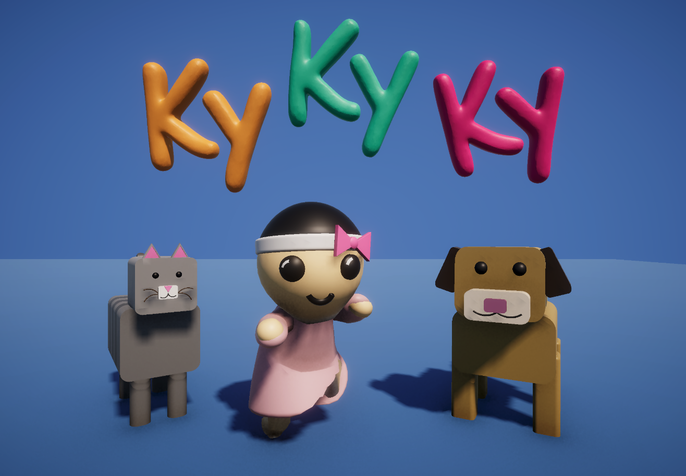
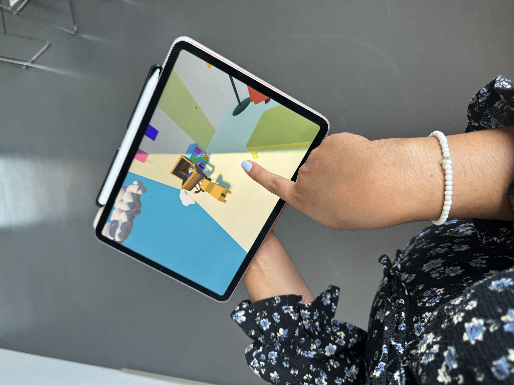

# Kykyky !

**Master Media Design 1 — Care Workshop — HEAD Genève**

Maria Sarafi · Rokhy Niang · Zainab Ouriachi

2026-06-16

---

## Overview

**Kykyky !** is an interactive, wordless experience for children aged 4–8 that explores cohabitation through the story of three roommates sharing the same apartment: baby **Rokhy**, **Lucky** the dog, and **Cheeky** the cat.

Rokhy and Lucky are born on the same day and quickly become inseparable companions, while Cheeky prefers to rule from her robot-cleaner throne, creating a playful tension between the three. Through a simple, playful narrative, the project reflects on the challenges of living together despite different needs, habits, and personalities. As Rokhy, Lucky, and Cheeky gradually become the *Kykyky team*, the project asks whether sharing a space also means sharing care — showing how empathy and attention to others can turn coexistence into belonging.

---

## Concept & Theme

The guiding principle of the project is **care** — not only as the subject of the story, but as something the experience itself communicates. The narrative explores cohabitation and love, and care that flows both ways: animals caring for people, and people caring for animals.

The experience is **not text-based**. It unfolds through a single, repeated gesture — **tapping** — that lets the story evolve at the child's own pace, guided entirely by sound, movement, and touch.

### Characters

- **Rokhy** — the baby, born the same day as Lucky.
- **Lucky** — the dog, Rokhy's inseparable companion.
- **Cheeky** — the cat, who arrives later and rules from her robot-cleaner throne.

---

## User Journey

The user discovers the world of Kykyky through a simple, playful interface. After tapping through the introduction, they interact with the story using a single gesture. Through repeated interactions, the user helps the characters approach, comfort, and care for one another, while observing the passage of time through changes in the environment and the characters' growth.

The story moves through three chapters:

1. **Day — Rokhy cries.** Baby Rokhy cries in her rocking chair until the user taps, helping Lucky reach her, comfort her, and gently rock her back to calm.
2. **Night — Lucky's nightmare.** While Lucky sleeps and whimpers from a nightmare, the user taps to help baby Rokhy crawl toward him, comforting him until he becomes calm and quiet.
3. **Cheeky arrives.** Cheeky arrives on her robot-cleaner throne, disrupting the harmony. When she eats from Lucky's bowl, the user taps to help Rokhy step in and restore peace, encouraging Cheeky to back away so Lucky can happily return to his meal.

By the end, all three characters respond together, forming the Kykyky team and demonstrating how a simple act of care can strengthen relationships within a shared living space.

---

## Art Direction

The project began with a moodboard that anchored its look and feel. Designing for an audience aged 4–8, the visuals themselves are meant to communicate care.

- **Soft colour palette and warm lighting** for a gentle, welcoming atmosphere.
- **Soft geometric shapes and rounded edges**, inspired by wooden children's toys — tactile, familiar, reassuring.
- **Deliberate restraint:** rather than overstimulate young players, the goal is a calm, easy-to-read environment that stays playful and joyful.
- **A sky background** gives the world the feeling of a children's fairy tale, while its transition from day to night marks the passage of time and adds a gentle rhythm.

The result channels the same warmth and tenderness the story is about.

---

## Field Research

To ground the project in real experiences of cohabitation, we conducted field interviews with residents of the **Ecoquartier Jonction**.

- **6 May 2026 — Cassandre:** interviewed about living with animals in a cluster apartment; she connected us with other residents and shared our questionnaire on the residents' common platform. We also distributed flyers across the four Ecoquartier buildings.
- **12 & 13 May 2026 — Marilène & Laura:** Marilène shares a cluster apartment where her cat (Shifumi, a Maine Coon) and dog (Achille, an English bulldog) are treated as cohabitants, not owned by any single person — a striking example of shared, mutual care. Laura lives in a regular apartment with her son and a home-born cat, and described how neighbours work together to make the building safer for animals.
- **Questionnaire (7 responses as of 22 May 2026):** broadly positive attitudes toward cohabitation, provided shared rules are respected (clean common spaces, leashed dogs, quiet, waste management). A recurring safety concern emerged around the building's slippery, outward-tilted metal parapets, where cats have fallen.

Together, these stories confirmed that cohabitation rests less on individual ownership than on **shared care and mutual responsibility**, and that the physical environment itself shapes the safety and well-being of the animals.

---

## Process

### Cardboard Prototype
We gathered existing animations to represent the three main characters and the key elements of the three chapters, printed and cut them out, and built a stop-motion sequence narrating the story from beginning to end. This hands-on approach let us test the flow of the narrative and visualise how each character and chapter would come to life before production.

### Greybox Prototype
Before production we ran a grey-boxing phase to test the scene setup, interactions, camera angles, and basic colour palette. This led to concrete early decisions — for example, having the camera shift to follow the actor of each interaction, keeping the player's attention anchored on what matters. We also defined the final scene elements (characters, objects, furniture, layout) and added two doors that simulate the common space of the Ecoquartier Jonction cluster building we visited, grounding the world in a real shared-living reference.

### User Tests
Testing ran in three phases:
1. **Paper prototype** — presented to the library team for early feedback; this confirmed the decision to develop a children's interactive experience.
2. **Grey boxing** — tested with classmates in class, with dedicated feedback sessions on scene setup, interactions, and camera angle.
3. **Production** — daily feedback applied continuously. Based on this, sound was recorded twice (the second time in a quiet box) and motion capture carried out twice to refine and smooth both sound and animation. Extensive work also went into rigging a 3D animal model so motion capture could drive the final animation of the dog.

---

## Final Production

If selected for exhibition, the following developments would be carried out:

- Additional level / storytelling
- Character animation for Lucky and Cheeky
- Additional motion-capture recordings for Cheeky
- Visual refinements and polishing
- Fine-tuning of interactions and transitions

---

## PDF Presentation

[Presentaion Care Kykyky](Press/2026-06-12-head-mmd1-care-Kykyky.pdf)

## Demo Final Video

[Kykyky Demo](https://youtu.be/d_SC7Zuwfw0)

## Credits

Maria Sarafi · Rokhy Niang · Zainab Ouriachi

Master Media Design 1 — Care Workshop, HEAD Genève, 2026