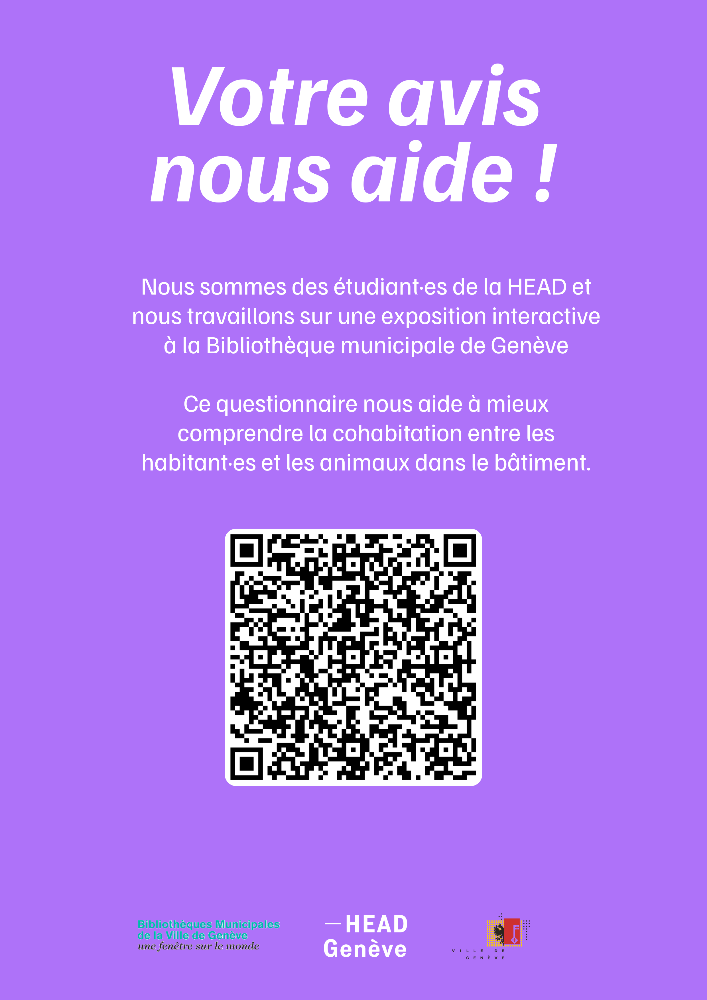

# KyKyKy — Project Process Journal

## Site Visits

### **[LES SUREAUX](https://lessureaux.ch/)** — 27 April 2026
Visit to Les Sureaux to explore shared housing and cohabitation models.

### **[CODHA Ecoquartier Jonction](https://www.codha.ch/fr/nos-immeubles/ecoquartier-jonction)** — [28 April 2026](https://drive.switch.ch/index.php/s/Ncs5WrPaIbbjoQC?path=%2Fmd1_care%2F3.Documentation%2FZainab%2BRokhy%2BMaria%2FJournal%2F2026.04.28)
Visit to CODHA's Ecoquartier Jonction to understand collective living in practice.

---

## Brainstorming & Concept Development

### 29 April 2026 — [Defining our subject](./2026-04-29-Story/)
We were assigned the subject **"The shared apartment: rules, sharing, adjustments"**.

During brainstorming, we noticed that one of the suggested scenarios already mentioned a dog named **Lucky**. We decided to create a cohabitation and growing-up story about a child, a dog, and a cat — exploring how they learn to live together and develop a strong relationship of love and care.

### 30 April 2026 — [Class Exercises](https://github.com/badjen221/head-md-care-kykyky/tree/main/Process/2026-04-30-Exercise)
After researching CODHA and the concept of cohabitation (including the role of pets), we worked on different class exercises and exchanged with the HLM project team.

---

# Field Research & Interviews
 
To ground our project in real experiences of cohabitation, we conducted a series of field interviews with residents of the Ecoquartier Jonction.
 
## 6 May 2026 — [Interview with Cassandre](https://github.com/badjen221/head-md-care-kykyky/tree/main/Process/2026-05-06_Interview-Cassandre-Questionnaire)
 
We interviewed Cassandre about living with animals in the Ecoquartier and her experience in a cluster apartment, and we asked her to connect us with other residents who have pets. To reach a wider group, we created a questionnaire that Cassandre shared on the residents' common communication platform, and we distributed flyers across the four Ecoquartier buildings to gather more responses and deepen our understanding for the project.

## Questionnaire responses (as of 22 May 2026)
 
| Espace | Animal ? | Type | Dérange ? | Peur ? | Allergies ? | Problèmes ? | Lesquels | Cohabitation ? | Règles importantes | Remarques |
|---|---|---|---|---|---|---|---|---|---|---|
| Cluster | Non | cette question est obligatoire mais je n'ai pas d'animal de compagnie | Pas du tout | des animaux sauvages, probablement :) | Non | Oui | On ne peut sélectionner qu'une option. Je dirai donc propreté, et fait qu'une fois qu'on laisse entrer un animal chez soi, on en est responsable, même s'il devient introuvable pour le faire ressortir ! | Oui | Nettoyer les espaces communs, Prévenir les voisins en cas de problème | Les architectes n'ont pas pensé aux animaux en construisant le bâtiment. Les parapets sont en métal, glissants, et penchés vers l'extérieur (pour évacuer la pluie). De nombreux chats sont morts en chutant. |
| Cluster | Non | Je n'ai pas d'animal de compagnie par respect pour la biodiversité et l'hyperconsommation des aliments industriels en lien avec ceux-ci, particulièrement chiens et chats. Je préfère les animaux libres et non domestiqués. | Cela dépend de plusieurs facteurs que votre questionnaire n'évoque pas. | Non | Non | Oui | Il faudrait pouvoir répondre à plusieurs facteurs à cette question | Oui avec certaines règles | Nettoyer les espaces communs, Tenir les chiens en laisse, Respecter le calme, Prévenir les voisins en cas de problème, Éviter les animaux dans certains espaces, Garder son animal dans son espace | Les chats sont un des animaux les plus disruptifs pour la biodiversité notamment pour les oiseaux et petits mamifères, Les impacts carbone EPP des animaux de compagnie ne sont pas du tout négligeables. Il y a très peu de reflexion sur ces questions dans notre immeuble censé pourtant être écolo. |
| Appartement | Non | Pas d'animal de compagnie | Un peu | Oui | Non | Non | Pas de problème | Oui avec certaines règles | Nettoyer les espaces communs, Tenir les chiens en laisse |  |
| Appartement | Non |  | Oui beaucoup | Oui | Non | Oui | Propreté | Oui avec certaines règles | Nettoyer les espaces communs, Respecter le calme, Éviter les animaux dans certains espaces, question de nombre | fondamentalement, l'animal n'est pas fait pour une vie en ville, en appartement d'où il est sorti 3X/j pour faire ses besoins. Voire les chiens pisser partout me dégoute. Mon voisin a deux chats qui ne sortent jamais et mangent des croquettes. Cela correspond-il à des mauvais traitements? |
| Appartement | Non |  | Pas du tout | Non | Non | Oui | un chat a glissé et a trouvé la mort dans la cour- s'il y avait une personne dans la cour, 10kg sur la tête, ça aurait été très grave | Oui avec certaines règles | les propriétaires doivent bien connaitre leur animal et être ouvert aux critiques en cas de problèmes. | non |
| Cluster | Non |  | Un peu | Non | Non | Oui | Propreté | Oui avec certaines règles | Nettoyer les espaces communs, Prévenir les voisins en cas de problème, Éviter les animaux dans certains espaces |  |
| Cluster | Oui | Chien chat et poissons | Pas du tout | Non | Oui, légères | Oui | Allergies, Animal s'introduit chez les voisins | Oui | Respecter le calme, Prévenir les voisins en cas de problème, Gérer les déjections / et la fuites des animaux |  |

## 12 & 13 May 2026 — [Interviews with Marilène & Laura](https://github.com/badjen221/head-md-care-kykyky/tree/main/Process/2026-05-12-13-Interviews)
 
Marilène shares a cluster apartment with others, including her daughter, her cat Shifumi — a Maine Coon — and a dog named Achille, an English Bulldog. What struck us most was how harmonious her experience was. There is no single owner of the animals; instead, Shifumi and Achille are treated as cohabitants, just like the people, and everyone helps one another to look after their well-being. This sense of mutual aid, of shared responsibility for the animals, was surprising in how naturally and harmoniously it worked. Her daughter is growing up alongside both animals, sharing everyday life and care with them.
 
Laura's situation was different: she lives in a regular apartment rather than a cluster like Marilène's, with her son and her cat, who grew up together the cat was born there and stays mostly inside, far less adventurous than Shifumi. Laura also told us about the riskier parts of the building that can be dangerous for cats, and how most of the neighbours work together to make the space safer for them.
 
These stories gave us strong, concrete examples of cohabitation, shared responsibility, and care flowing between people and animals the very themes at the heart of our project.

---

## Our Story — The KyKyKy Team

Inspired by these encounters, we developed a cohabitation story centred around:
- **Rokhy** — a baby girl
- **Lucky** — a dog
- **Cheeky** — a cat

Together they form the **KyKyKy team**.

---

## Prototype & Feedback

### 19 May 2026 — Prototype Presentation
We presented our prototype to **Cassandre** and **Muriel**, who guided us towards building an **interactive story for children**. They advised us to focus on a specific age group.
[See Readme Press](/Press/readme.md)

### Now — Greyboxing
We are currently working on a greyboxing prototype to define camera angles and basic interactions.
[Unity Greybroxing](/Unity/2026-05-20-Maquette/Kykyky-Greyboxing)

---

## Additional Process Material

→ [All Process Material](https://shorturl.at/TSFFa)