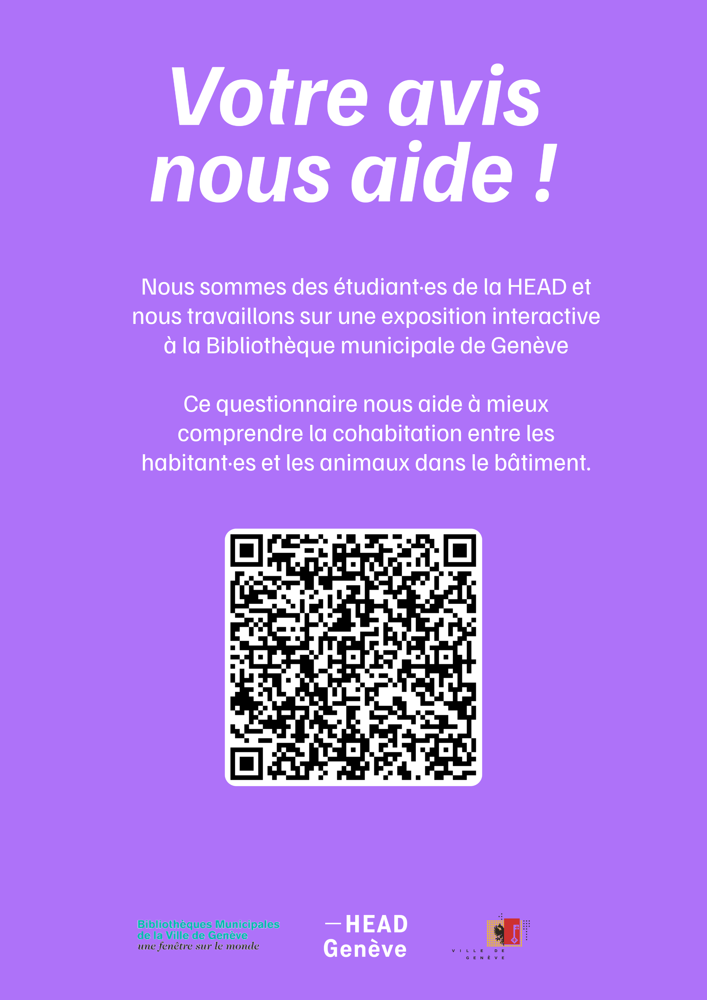

# KyKyKy — Project Process Journal

## Site Visits

### **[LES SUREAUX](https://lessureaux.ch/)** — 27 April 2026
Visit to Les Sureaux to explore shared housing and cohabitation models.

### **[CODHA Ecoquartier Jonction](https://www.codha.ch/fr/nos-immeubles/ecoquartier-jonction)** — [28 April 2026](https://drive.switch.ch/index.php/s/Ncs5WrPaIbbjoQC?path=%2Fmd1_care%2F3.Documentation%2FZainab%2BRokhy%2BMaria%2FJournal%2F2026.04.28)
Visit to CODHA's Ecoquartier Jonction to understand collective living in practice.

---

## Brainstorming & Concept Development

### 29 April 2026 — [Defining our subject](./2026-04-29-Story/)
We were assigned the subject **"The shared apartment: rules, sharing, adjustments"**.

During brainstorming, we noticed that one of the suggested scenarios already mentioned a dog named **Lucky**. We decided to create a cohabitation and growing-up story about a child, a dog, and a cat — exploring how they learn to live together and develop a strong relationship of love and care.

### 30 April 2026 — [Class Exercises](https://github.com/badjen221/head-md-care-kykyky/tree/main/Process/2026-04-30-Exercise)
After researching CODHA and the concept of cohabitation (including the role of pets), we worked on different class exercises and exchanged with the HLM project team.

---

## Field Research & Interviews

### 6 May 2026 — [Interview with Cassandre](https://github.com/badjen221/head-md-care-kykyky/tree/main/Process/2026-05-06_Interview-Cassandre-Questionnaire)
We interviewed **Cassandre** about cohabitation with animals in the Ecoquartier Jonction and her experience living in a cluster apartment. We also asked her to connect us with residents who have pets.

We created a questionnaire that Cassandre shared on their common communication platform, and distributed flyers across the four Ecoquartier buildings.

→ [Questionnaire Results as of 22 May 2026](https://shorturl.at/HarKg)

### 12 & 13 May 2026 — [Interviews with Marilène & Laura](https://github.com/badjen221/head-md-care-kykyky/tree/main/Process/2026-05-12-13-Interviews)

**Marilène** shares a cluster apartment with others, including her daughter, her cat **Shifumi**, and a dog named **Achille**. Her daughter is growing up together with Achille and Shifumi, sharing everyday life and care.

**Laura** lives in an apartment with her son and her cat. Her son and the cat grew up together, and the cat stays mostly inside as she was born there.

These stories offered strong examples of cohabitation, shared responsibility, and care.

---

## Our Story — The KyKyKy Team

Inspired by these encounters, we developed a cohabitation story centred around:
- **Rokhy** — a baby girl
- **Lucky** — a dog
- **Cheeky** — a cat

Together they form the **KyKyKy team**.

---

## Prototype & Feedback

### 19 May 2026 — Prototype Presentation
We presented our prototype to **Cassandre** and **Muriel**, who guided us towards building an **interactive story for children**. They advised us to focus on a specific age group.
[See Readme Press](/Press/readme.md)

### Now — Greyboxing
We are currently working on a greyboxing prototype to define camera angles and basic interactions.
[Unity Greybroxing](/Unity/2026-05-20-Maquette/Kykyky-Greyboxing)

---

## Additional Process Material

→ [All Process Material](https://shorturl.at/TSFFa)