# MOODBOARD

For our moodboard, we choose images from the following games.

### Lumino City

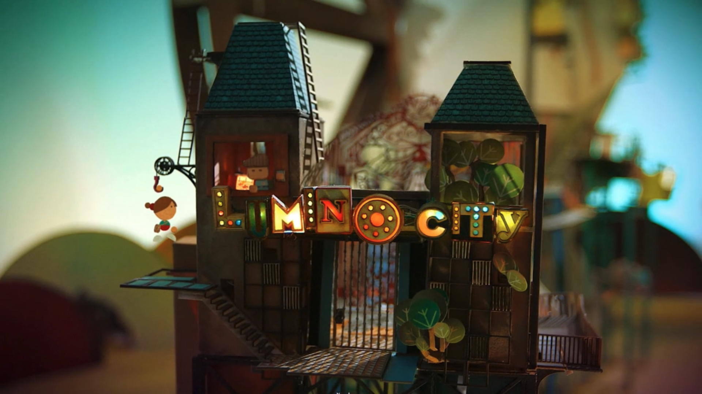

  <table>
    <tr>
      <td align="center">
        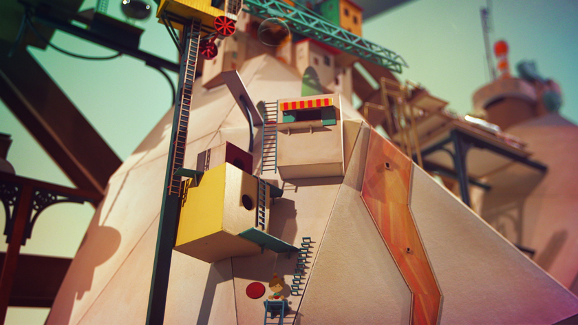 
      </td>
      <td align="center">
        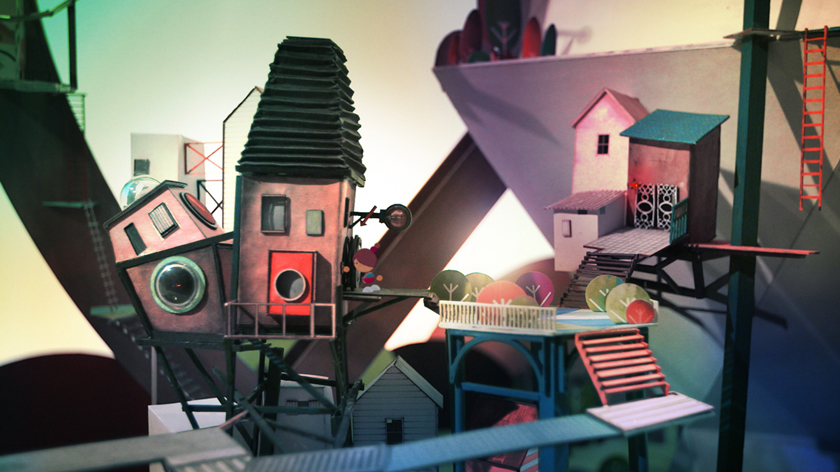 
      </td>
    </tr>
  </table>

### GNOG

  <table>
    <tr>
      <td align="center">
        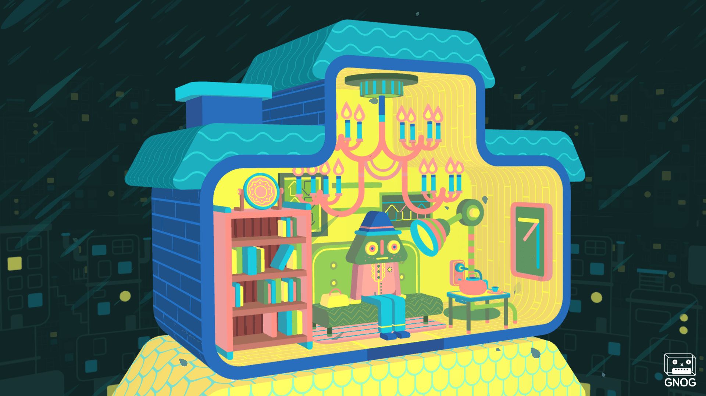 
      </td>
      <td align="center">
        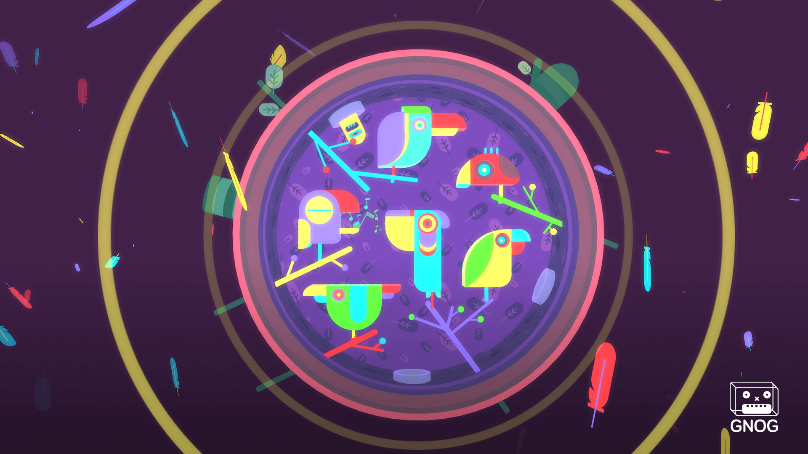 
      </td>
    </tr>
  </table>

### Monument Vallley
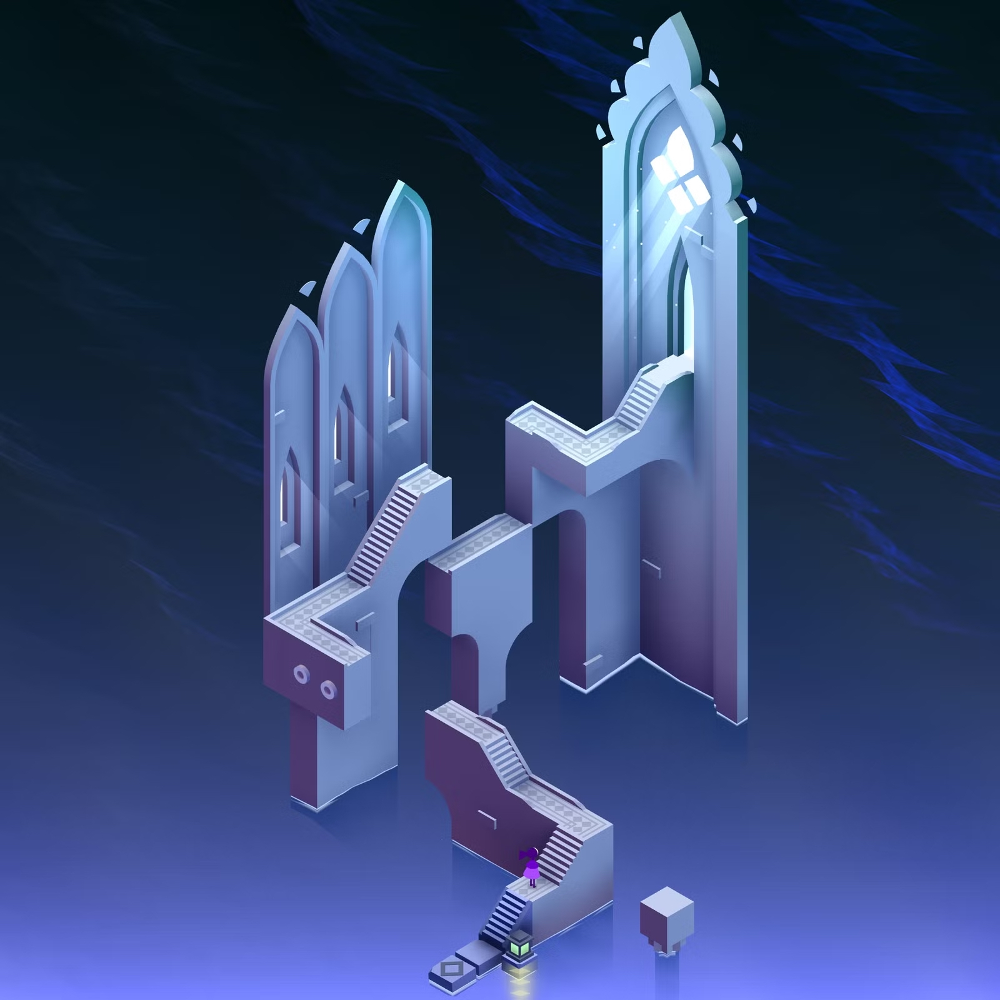

  <table>
    <tr>
      <td align="center">
        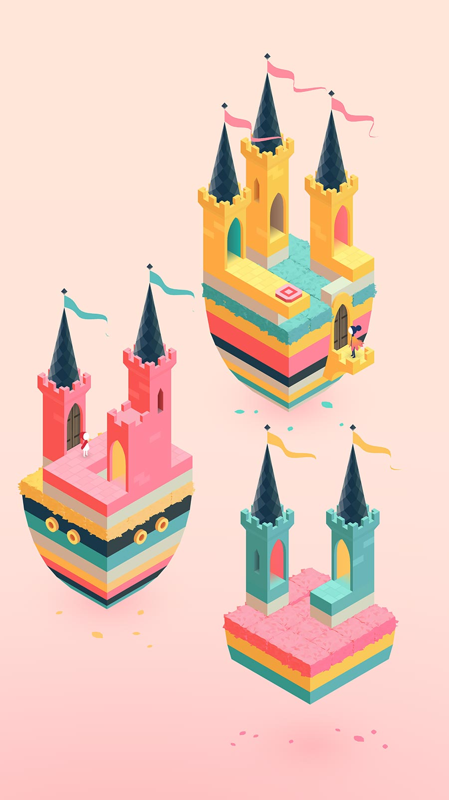 
      </td>
      <td align="center">
        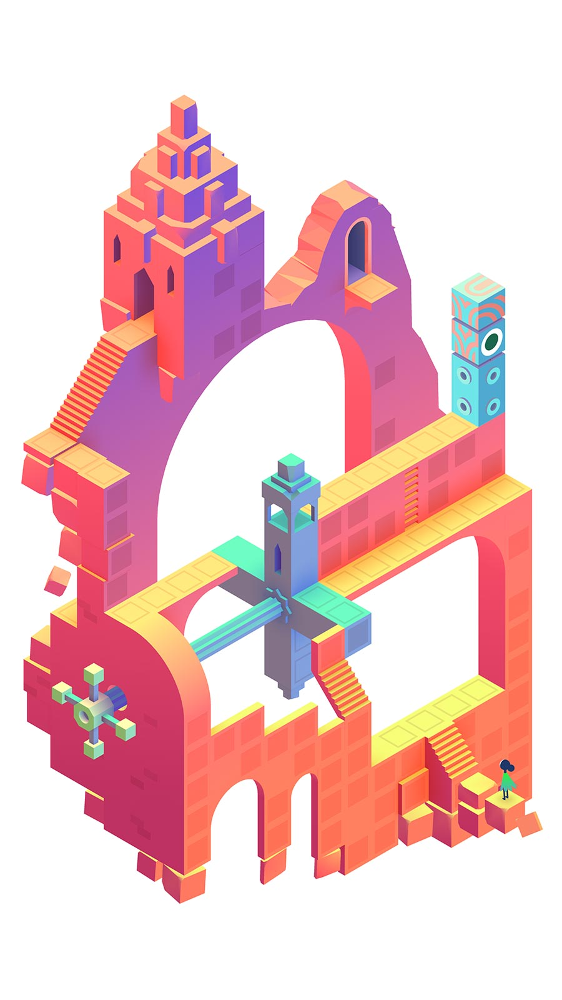 
      </td>
    </tr>
  </table>

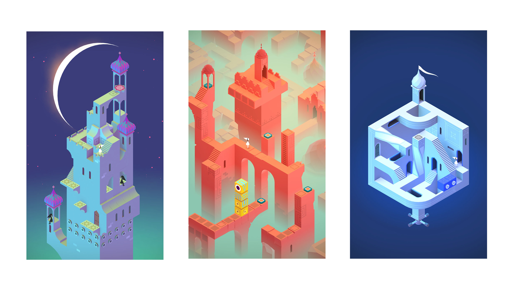

### Oracle Of Suits - Chronocards

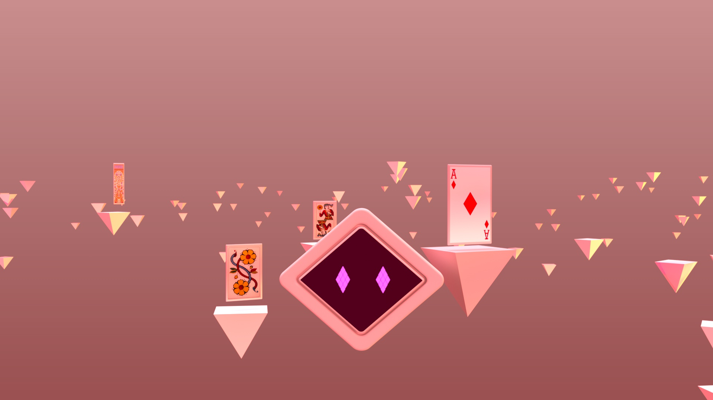

  <table>
    <tr>
      <td align="center">
        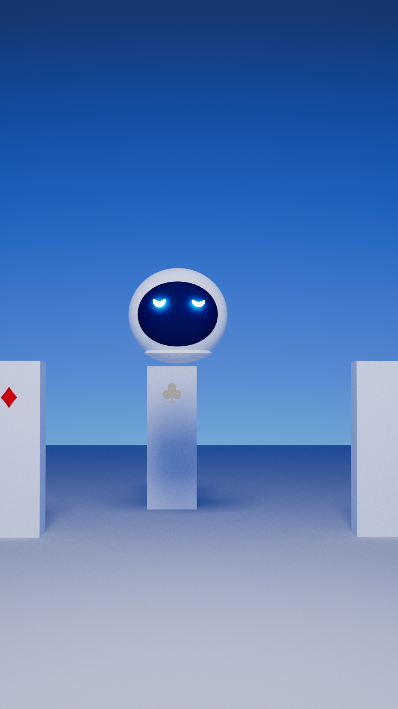 
      </td>
      <td align="center">
        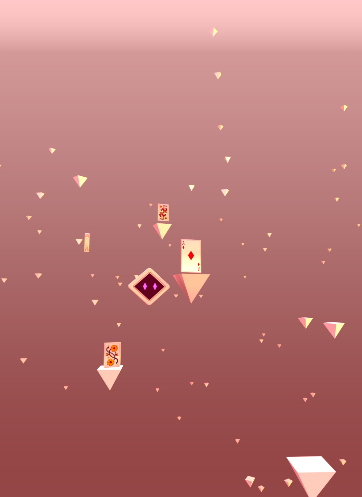 
      </td>
    </tr>
  </table>

### Situated Bodies

### The Family Next Door Intro

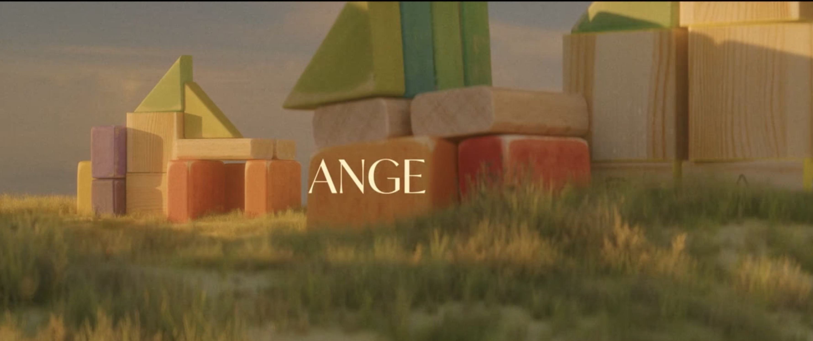
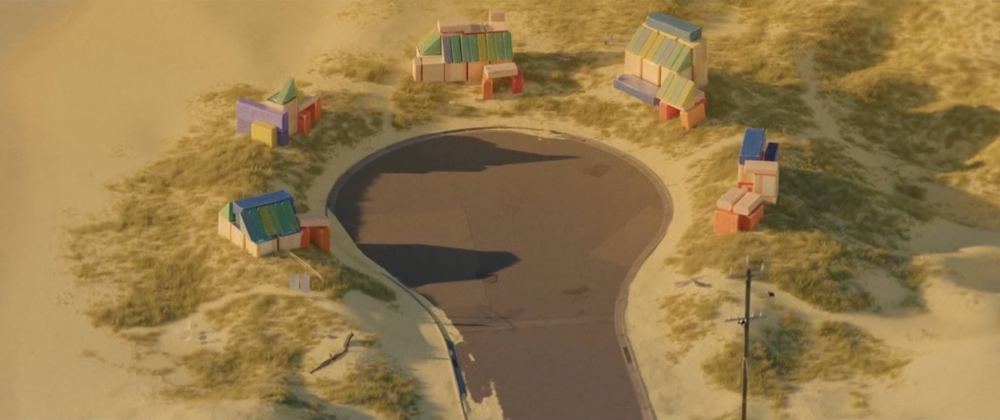

### Idea for exibition

We can integrate the ipad into a house paper structure.

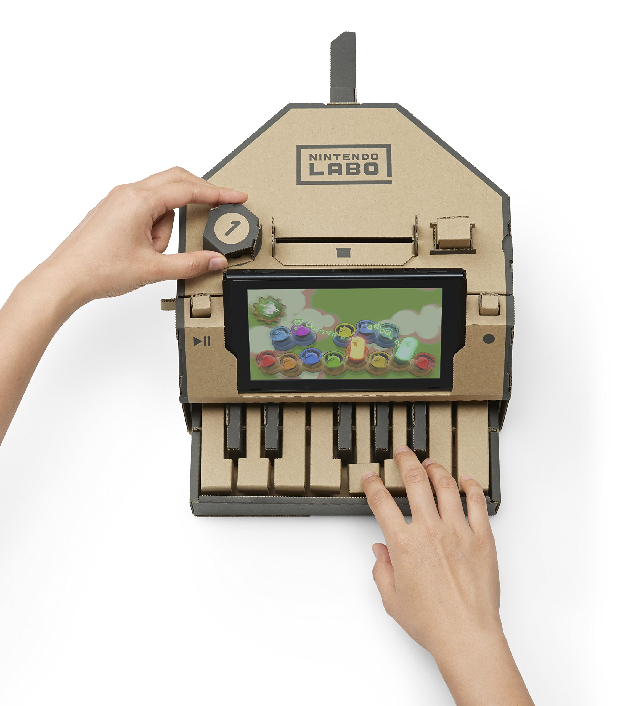

### Characters

